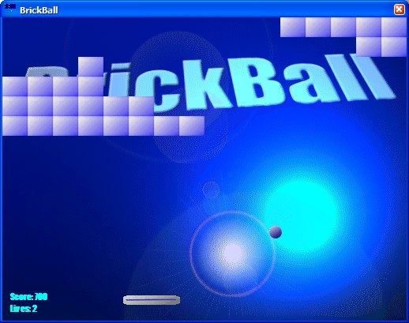



## BrickBall

### Description

BrickBall is a breakout-type game that uses BitBlt very efficiently, in fact this game runs full speed on a 486! It is also made for 256-color systems. (uses a palette). If you want to make efficient 2D games, here is your start.

Use the mouse to move the paddle, and hit the ball into the bricks. There is also a level editor just in case you feel you need one..

Let me know how this works, vote if you like it!
 
### More Info
 

             |
---                |---
**Submitted On**   |2003-05-16 15:06:14
**By**             |[Marshall H\.](https://github.com/Planet-Source-Code/PSCIndex/blob/master/ByAuthor/marshall-h.md)
**Level**          |Intermediate
**User Rating**    |5.0 (30 globes from 6 users)
**Compatibility**  |VB 4\.0 \(32\-bit\), VB 5\.0, VB 6\.0
**Category**       |[Games](https://github.com/Planet-Source-Code/PSCIndex/blob/master/ByCategory/games__1-38.md)
**World**          |[Visual Basic](https://github.com/Planet-Source-Code/PSCIndex/blob/master/ByWorld/visual-basic.md)
**Archive File**   |[BrickBall1724923262004\.zip](https://github.com/Planet-Source-Code/marshall-h-brickball__1-52672/archive/master.zip)

